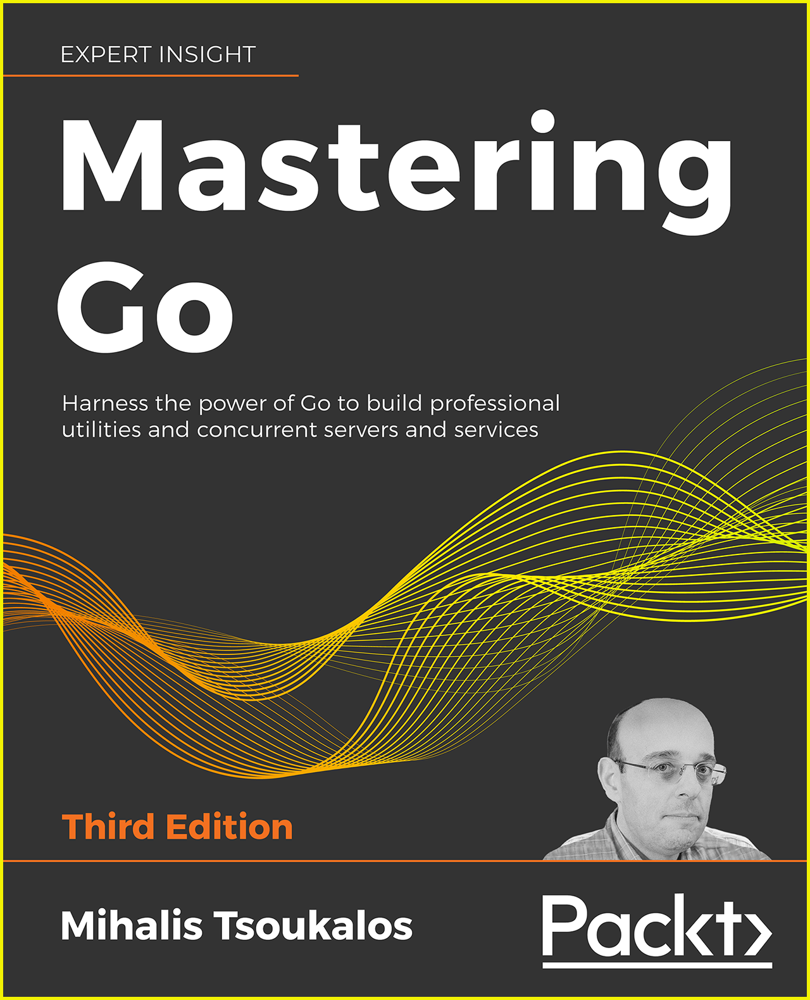

# mastering-Go-3rd

Source code for Mastering Go, 3rd edition book.

Go is a modern, generic-purpose, open source programming language that was officially announced at the end of 2009. Go began as an internal Google project, which means that it was started as an experiment, and has since been inspired by many other programming languages, including *C*, *Pascal*, *Alef*, and *Oberon*. Go's spiritual fathers are the professional programmers ``Robert Griesemer``, ``Ken Thomson``, and ``Rob Pike``.

Mastering Go, 3rd Edition explores the capabilities of Go *in practice*. You are going to become confident with advanced Go concepts, including concurrency and the operation of the *Go Garbage Collector*, using Go with Docker, writing powerful command line utilities, working with JSON data, and interacting with databases. You are also going to improve your understanding of Go internals to optimize Go code and use data types and data structures in new and unexpected ways. This book also covers the nuances and idioms of Go with exercises and resources to fully embed your newly acquired knowledge. Become an expert Go programmer by building Go projects, writing system utilities and implementing advanced Go techniques in your projects.

Code repositories for the 1st and 2nd edition of *Mastering Go* are available at

- https://github.com/PacktPublishing/Mastering-Go
- https://github.com/PacktPublishing/Mastering-Go-Second-Edition

**Mastering Go, 3rd Edition**  

Published August 2021

* Paperback: around 700 pages
* Publisher: Packt Publishing  
* Language: English

- ISBN-10: 1801079315
- ISBN-13: 978-1801079310
- Kindle ASIN: ‎B09C8R34JM

## Links

- [Amazon Page](https://www.amazon.com/Mastering-Go-professional-utilities-concurrent-dp-1801079315/dp/1801079315)
- [Packt Page](https://www.packtpub.com/product/mastering-go-third-edition/9781801079310)
- [Go](https://golang.org)

## Table of Contents

* Chapter 1: A Quick Introduction to Go
* Chapter 2: Basic Go Data Types
* Chapter 3: Composite Data Types
* Chapter 4: Reflection and Interfaces
* Chapter 5: Go Packages and Functions
* Chapter 6: Telling a UNIX System What to Do
* Chapter 7: Go Concurrency
* Chapter 8: Building Web Services
* Chapter 9: Working with TCP/IP and WebSocket
* Chapter 10: Working with REST APIs
* Chapter 11: Code Testing and Profiling
* Chapter 12: Working with gRPC
* Chapter 13: Go Generics
* Appendix A: Go Garbage Collector

For a more analytical TOC, please visit [this](https://www.mtsoukalos.eu/2021/08/mastering-go-3rd-edition-toc/) blog post.

